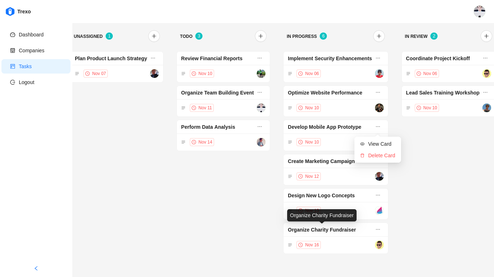
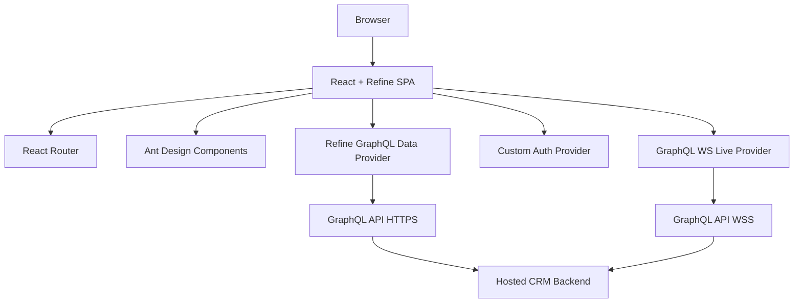

<h1>
  
 Trexo - Admin Dashboard
</h1>


[](./LICENSE)



## Overview

Trexo is a React + TypeScript CRM-style admin dashboard built with Refine and Ant Design.  
It provides authenticated workflows for managing companies and tasks, plus dashboard analytics for deals, contacts, and activity streams.

This project is aimed at developers building internal tools/admin products and serves as a production-like frontend that connects to a hosted GraphQL API.

Primary capabilities include:

- Authentication and identity-aware UI
- Dashboard analytics (counts, pipeline chart, upcoming events, latest activities)
- Company management (list, search, create, edit, delete)
- Company contact exploration with filtering
- Task management using a drag-and-drop Kanban board
- Inline task editing (title, stage, due date, description, assignees)
- Real-time/live data integration via GraphQL WebSocket provider

---

## Key Features

- Refine-powered resource routing for `dashboard`, `companies`, and `tasks`
- GraphQL data provider integration with typed queries/mutations
- Optimistic and auto-save task updates in modal workflows
- Drag-and-drop stage transitions for tasks (`@dnd-kit/core`)
- Account settings drawer with user profile editing
- Markdown task description editing (`@uiw/react-md-editor`)
- Ant Design themed layout with reusable UI and loading skeleton states
- Generated GraphQL TypeScript types via GraphQL Code Generator

---

## Tech Stack

### Frontend

- React 19
- TypeScript
- React Router 7
- Refine (`@refinedev/core`, `@refinedev/antd`, `@refinedev/react-router`, `@refinedev/kbar`, `@refinedev/devtools`)
- Ant Design 5
- Ant Design Plots (`@ant-design/plots`)
- DnD Kit (`@dnd-kit/core`)
- `@uiw/react-md-editor`
- `dayjs`

### Backend

- No backend service is implemented in this repository
- The app consumes a remote GraphQL API:
  - HTTP: `https://api.crm.refine.dev/graphql`
  - WebSocket: `wss://api.crm.refine.dev/graphql`

### Database

- Not implemented in this repository (data persistence is external to this codebase)

### Infrastructure

- Docker multi-stage build (`Dockerfile`)
- Static production serving via `serve` (Node-based runtime image)

### Build Tools

- Vite 6
- Refine CLI (`refine dev`, `refine build`, `refine start`)
- TypeScript compiler (`tsc`)
- GraphQL Code Generator

### Testing

- No automated test framework/configuration found in the repository

### Developer Tooling

- ESLint 9 (flat config)
- Prettier
- GraphQL config (`graphql.config.ts`)
- Path aliases via `vite-tsconfig-paths` (`@/* -> src/*`)

---

## Architecture Overview

Trexo is a **single-package frontend application** with a **modular monolith UI architecture**.  
Business modules are organized by feature (`pages/company`, `pages/tasks`, `components/home`, etc.) and share common providers/utilities.

It relies on Refine abstractions for:

- Resource routing and navigation
- Data fetching/mutations
- Auth lifecycle
- Live updates
- Form orchestration

### Mermaid Diagram



---

## Module & Package Mapping

- `src/index.tsx`  
  Application bootstrap and React root render.

- `src/App.tsx`  
  Global app composition: Refine providers, route tree, auth guards, layout integration, devtools.

- `src/providers/`
  - `auth.ts`: login/logout/check/getIdentity behavior using GraphQL
  - `data/index.tsx`: GraphQL client, data provider, live provider
  - `data/fetch-wrapper.ts`: auth headers + GraphQL error normalization

- `src/config/resources.tsx`  
  Refine resource registry and route metadata.

- `src/pages/`  
  Route-level feature screens:
  - `home` dashboard
  - `company` list/create/edit + contacts table
  - `tasks` Kanban list/create/edit modal flows
  - `login`, `register`, `forgotPassword`

- `src/components/`  
  Reusable UI and feature components:
  - home widgets/charts/activity
  - layout/header/user settings
  - kanban primitives and task edit forms
  - tags, typography, avatars, skeletons

- `src/graphql/`  
  Query/mutation documents and generated schema/operation types.

- `src/constants/`  
  Domain option catalogs (industry, business type, company size, contact status) and dashboard visual variants.

- `src/utils/`  
  Formatting and mapping helpers (currency, date formatting/coloring, chart data shaping, initials/color utilities).

This repository does not contain multiple apps/packages (not a monorepo).

---

## Data Flow Analysis

### Request lifecycle

1. Route/component hook (`useList`, `useTable`, `useForm`, `useCustom`) triggers Refine data operation.
2. Refine data provider (`@refinedev/nestjs-query`) sends GraphQL HTTP request.
3. `fetch-wrapper.ts` injects `Authorization` header and normalizes GraphQL errors.
4. UI updates through Refine query/mutation state.

### Authentication and authorization

1. Login sends GraphQL `login` mutation with email.
2. Returned `accessToken` is stored in `localStorage` (`access_token`).
3. `authProvider.check` executes `me` query to validate session.
4. `Authenticated` route wrapper redirects unauthenticated users to `/login`.
5. Logout clears token from `localStorage`.

### Persistence

- All persistence occurs through remote GraphQL API operations.
- No local database/filesystem persistence layer in this repository.

### API communication

- GraphQL queries and mutations are declared in `src/graphql/queries.ts` and `src/graphql/mutations.ts`.
- Generated operation and schema types provide compile-time typing.

### Realtime/live flow

- WebSocket client (`graphql-ws`) is initialized with bearer token.
- Refine live provider is enabled with `liveMode: "auto"`.
- The app is prepared for subscription-driven updates via backend support.

---

## Routes and Product Surface

- `/`  
  Dashboard: total counts, upcoming events, deals chart, latest activities

- `/companies`  
  Company list with search/filter, pagination, edit/delete actions

- `/companies/new`  
  Create company modal

- `/companies/edit/:id`  
  Edit company details + related contacts table

- `/tasks`  
  Kanban board grouped by task stage, drag-and-drop updates

- `/tasks/new`  
  Create task modal (optional `stageId` query param)

- `/tasks/edit/:id`  
  Edit task modal with accordion sections and autosave patterns

- `/login`, `/register`, `/forgot-password`  
  Auth pages via Refine `AuthPage`

---

## Getting Started

## Prerequisites

- Node.js and npm
- Docker (optional, for containerized run)

## Install

```bash
npm ci
```

## Development

```bash
npm run dev
```

## Build

```bash
npm run build
```

## Production Preview (Refine)

```bash
npm run start
```

## Lint

```bash
npm run lint
```

## Regenerate GraphQL Types

```bash
npm run codegen
```

---

## Environment & Configuration

- `.env` exists but no `process.env` / `import.meta.env` consumption is present in source.
- API endpoints are currently hardcoded in `src/providers/data/index.tsx`.
- GraphQL schema/codegen config is in `graphql.config.ts`.

---

## Docker

Build image:

```bash
docker build -t trexo .
```

Run container:

```bash
docker run --rm -p 3000:3000 trexo
```

The Docker image builds static assets and serves `dist/` using `serve`.

---

## Notable Implementation Details

- Uses `BrowserRouter` + Refine router provider with resource metadata.
- Global layout is `ThemedLayout` + fixed sider and custom header.
- Task editing is modal-based and includes:
  - inline editable title with autosave
  - stage updates with immediate autosave
  - markdown description editor
  - due date picker
  - multi-user assignment
- Company edit page combines entity form editing and related contacts data table.
- Dashboard visualizations are data-backed (counts and deal aggregates) with Ant Design Plots.

---

## Limitations Observed in Repository

- No automated tests included.
- No local backend/database or infrastructure-as-code manifests.
- No CI/CD workflows found under `.github/workflows`.
- `.env` is currently unused by source code.
- Auth login mutation in `authProvider` uses only email (demo-style flow).

---

## License

This project is licensed under the **MIT License**. See the [](./LICENSE) for details.
